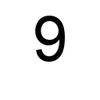

# 🧠 Fundamental Research in Machine and Deep Learning: Controlled Dataset

This repository provides a **controlled synthetic dataset** designed to evaluate whether **Attentive Group Equivariant CNNs (AGE-CNNs)**—can learn task specific equivariance and focus on transformations that matter for the task while ignoring those that do not.

---

## Problem Statement

Convolutional Neural Networks (CNNs) are widely used for image recognition tasks due to their ability to detect local patterns regardless of their position in the image. This property is known as **translation equivariance**.

To generalize equivariance beyond translations, **Group Convolutional Neural Networks (Group CNNs)** were introduced by *Cohen and Welling*, which incorporate transformations such as rotations and flips directly into convolutional layers. These models aim to achieve equivariance to a broader set of transformations, improving generalization for tasks where such transformations are semantically meaningful.

However, standard Group CNNs treat all transformations equally, regardless of their relevance to the task. *Romero et al.* proposed extending Group CNNs with an attention mechanism** over the transformation group to weight transformations by importance.

This controlled dataset is designed to verify equivariance in this context. Specifically, models should learn to:
- Respond differently to transformations that affect the class label (e.g., rotation turning a 6 into a 9),
- While ignoring transformations that do not (e.g., rotation of an 8).

---

## Dataset Description

- **Digits:** {6, 7, 8, 9}
- **Rotations:** {0°, 90°, 180°, 270°}
- **Total samples:** 16 (each digit in each 4 orientations)
- **Labels:** Reflect the digit identity after rotation:
  - Rotated 6 → 9 and vice versa
  - Rotated 7 or 8 → same label
- **Image Format:** Grayscale, 128×128 px, white background


Below are examples of the generated images, showing how the same digit appears under different rotations:

| Original 6 (0°  → label 6) | Rotated 6 (180° → label 9) | 8 (all rotations → label 8) |
|-----------------|-----------------------------|------------------------------|
|  |  |  |

> Note: These images will appear once you've run the dataset generator and are stored in the `controlled_digits/` folder.


## Evaluation Method

This dataset is specifically designed to test task-specific equivariance. For such a controlled setting, the most interpretable metric is accuracy:

$$
\text{Accuracy} = \frac{\text{Number of correct predictions}}{\text{Total number of samples}}
$$

- **Total samples**: 16 (4 digits × 4 rotations)
- **Correct prediction**: predicted label matches the ground-truth after considering the rotation logic

### Expected Outcome

- **AGE-CNNs** should achieve the highest accuracy as they explicitly model attention over transformation groups.
- **Standard Group CNNs** may confuse symmetrical and asymmetrical transformations, lowering accuracy.

> Tip: Because the dataset is small, you can inspect predictions **sample by sample** to qualitatively evaluate whether the model learned which transformations matter.

---

##  How to Generate the Dataset

Install dependencies using:

```bash
pip install -r requirements.txt
```

Run the generator:
```bash
python generate_data.py
```
